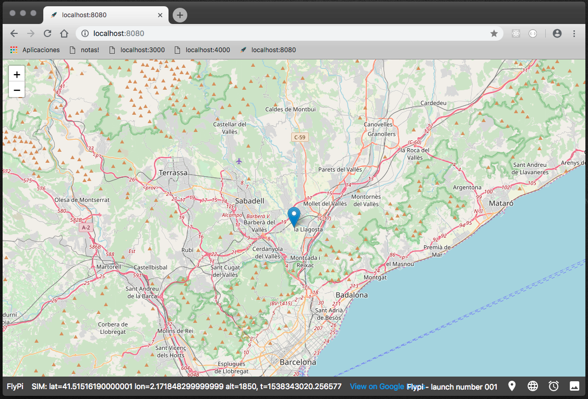
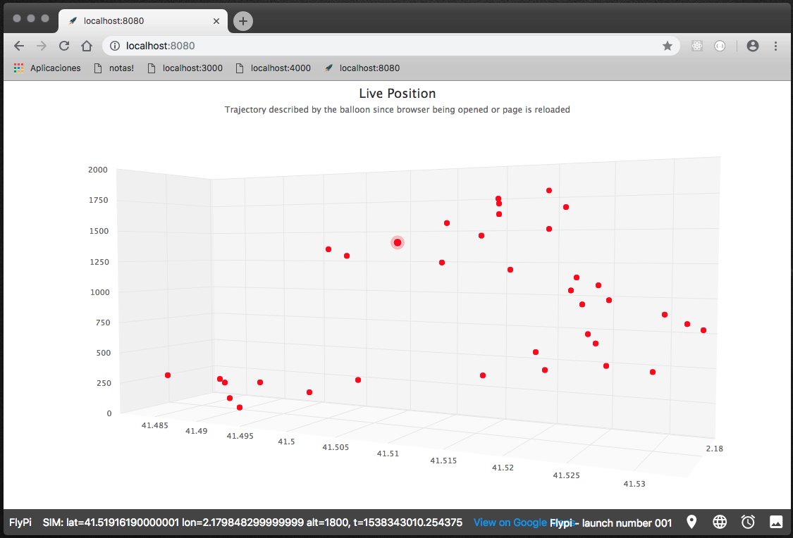
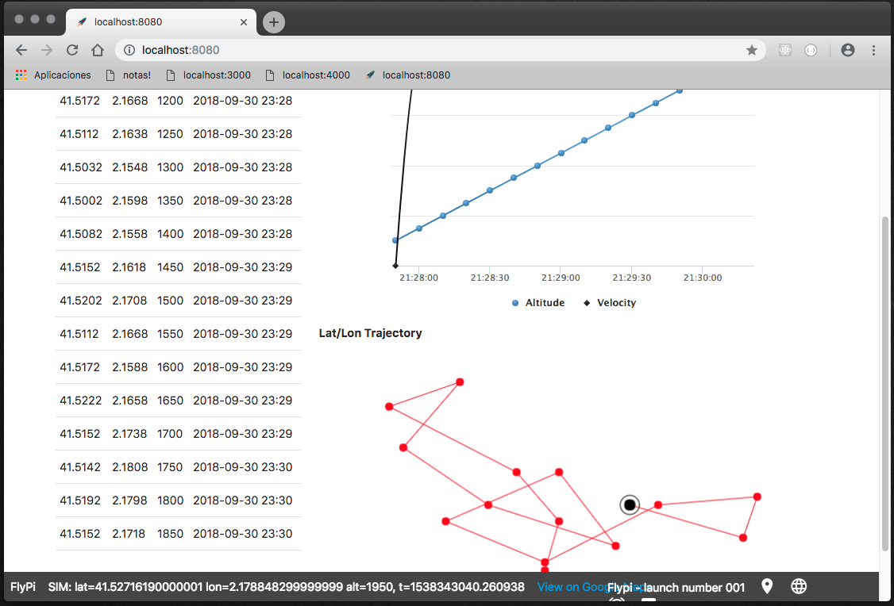

# Flypi


Flipy is a web-based user interface to interact with data that comes from [Pi-in-the-sky lora-gateway](https://github.com/PiInTheSky/lora-gateway) project.


## Installation

Clone this repository and access on it
```
git clone https://github.com/riqui99/flypi
cd flypi
```

Then, using [pip](https://pip.pypa.io/en/stable/installing/) package manager for Python, install all dependencies:

```
sudo pip install bottle
sudo pip install gevent-websocket
sudo pip install pymongo==3.5
// or
sudo pip install -r requirements.txt
```

You need to install: `sudo apt-get install python-dev`.

For save data on database: `sudo apt-get install mongodb-server`.

>Note: For performance, Flypi allows you to save the sessions of flights in MongoDB, but this is not a requirement. If you do not have MongoDB installed and running on the system, it is automatically detected and the sessions being stored on file system instead of database.


## How to run this application

`python server.py` (Expected [Pi-in-the-sky lora-gateway](https://github.com/PiInTheSky/lora-gateway) be running and receiving data)

If you want change some parameter, or you want run this software in simulation mode (without lora-gateway), you should call the server with -c argument and configure `config.json` file.

`python server.py -c "config.json"`

The config file is a json file (you can found it on the project root path) with the follow parameters:
  - server port: (integer) The port where the server is running.
  - mongo_host: (string) If you want to use MongoDB remotely, you can define the host using this parameter.
  - mongo_port: (integer) Port for MongoDB connection.
  - simulate: (boolean) Set value to true for use this software without lora-gateway or use with a simulated flight. Set to false for use with lora-gateway.


## Some features
View position of balloon in a map.



View trajectory of balloon in a three-dimensional graph.



Save sessions with data of the flights and view usefull graphs.



## Run the tests:
`python test/tests.py`


## Todos

 - Reconnection socket
 - Add more statistics in session section
 - Use all JS dependencies locally (leaflet, material icons, highcharts)
 - Improve popups (now are using javascript native for confirmations - create session)
 - Add navigation to follow the balloon on live with map.
 - Share in social media (create a public area in another server to sync sessions amd make public flights)
 - Store images on database
 - Create video - as a gif - with all images of the flight
 - Write Tests
 - Add Night Mode

License
----

MIT